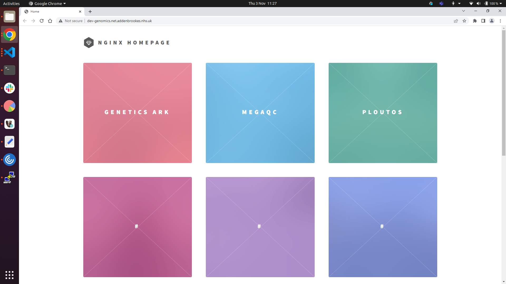

# nginx-home
simple homepage for nginx-proxy

# Usage
```
# Build docker image 
docker build -t ngx_home .
# Spin up in detached mode 
docker run -e VIRTUAL_HOST=localhost -e VIRTUAL_PATH=/ --expose 8000 --network=nginx_default ngx_home
```


